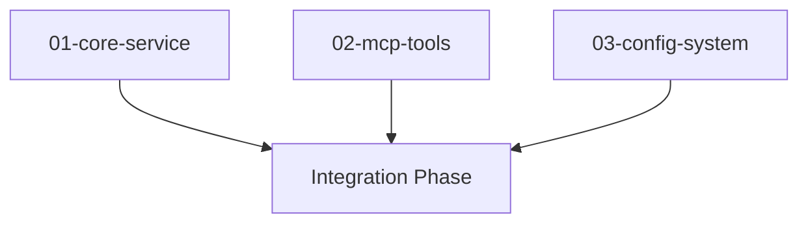
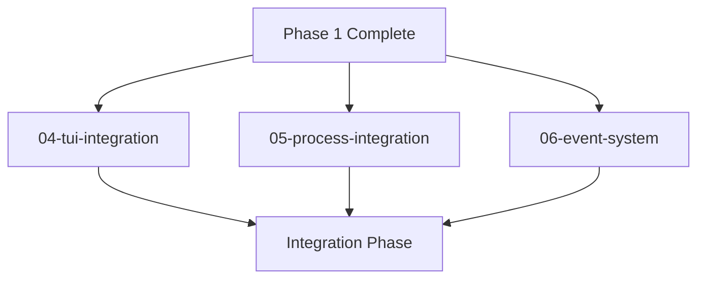
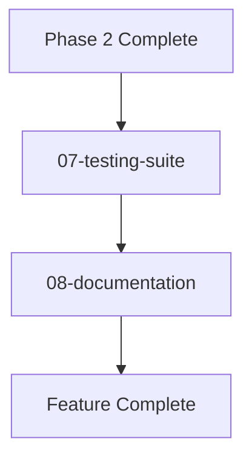

# Subtasks Execution Guide: Agentic AI Coders

**Generated**: 2025-01-28
**Context Package**: [`/requests/agentic-ai-coders/context/`](./context/)
**Task Files**: [`/requests/agentic-ai-coders/tasks/`](./tasks/)

## Execution Overview

This guide provides the execution strategy for implementing the "agentic AI coders in a tab in the TUI" feature through 8 atomic subtasks. The implementation follows a tmux-style interactive design where AI coders run as persistent sessions that users can attach to and detach from, with real-time error reporting from Brummer to the AI.

**Design Vision**: "This design makes AI coders feel like pair programming sessions where Brummer acts as the development environment providing real-time feedback to both the human and AI."

### Implementation Strategy

**Execution Method**: Parallel worktree development with staged integration
**Total Estimated Time**: 150 minutes (2.5 hours)
**Team Size**: 4-6 developers working in parallel
**Integration Points**: 3 major integration phases

## Task Execution Order

### Phase 1: Foundation (Parallel)
**Duration**: 60 minutes
**Tasks**: 01, 02, 03
**Dependencies**: None - fully parallel



**Task 01: Core Service** (25 min)
- **Owner**: Senior Backend Developer
- **Worktree**: `~/work/worktrees/agentic-ai-coders/01-core-service/`
- **Output**: Complete AI coder service layer
- **Key Deliverable**: `AICoderManager` interface

**Task 02: MCP Tools** (20 min)
- **Owner**: API Integration Developer  
- **Worktree**: `~/work/worktrees/agentic-ai-coders/02-mcp-tools/`
- **Output**: 6 MCP tools for AI coder control
- **Key Deliverable**: `ai_coder_*` tool suite

**Task 03: Configuration** (15 min)
- **Owner**: DevOps/Configuration Developer
- **Worktree**: `~/work/worktrees/agentic-ai-coders/03-config-system/`
- **Output**: Complete configuration system
- **Key Deliverable**: TOML configuration structure

### Phase 2: Integration & UI (Parallel)
**Duration**: 65 minutes
**Tasks**: 04, 05, 06
**Dependencies**: Requires Phase 1 completion



**Task 04: TUI Integration** (30 min)
- **Owner**: Frontend TUI Developer
- **Worktree**: `~/work/worktrees/agentic-ai-coders/04-tui-integration/`
- **Output**: Complete TUI view for AI coders
- **Key Deliverable**: `ViewAICoders` with BubbleTea components

**Task 05: Process Integration** (20 min)
- **Owner**: Systems Integration Developer
- **Worktree**: `~/work/worktrees/agentic-ai-coders/05-process-integration/`
- **Output**: AI coder processes in process manager
- **Key Deliverable**: Process coordination and event bridging

**Task 06: Event System** (18 min)
- **Owner**: Event Systems Developer
- **Worktree**: `~/work/worktrees/agentic-ai-coders/06-event-system/`
- **Output**: AI coder event types and handlers
- **Key Deliverable**: Event aggregation and real-time updates

### Phase 3: Quality Assurance (Sequential)
**Duration**: 47 minutes
**Tasks**: 07, 08
**Dependencies**: Requires Phase 2 completion



**Task 07: Testing Suite** (25 min)
- **Owner**: QA/Testing Developer
- **Worktree**: `~/work/worktrees/agentic-ai-coders/07-testing-suite/`
- **Output**: Comprehensive test coverage
- **Key Deliverable**: Unit, integration, and system tests

**Task 08: Documentation** (22 min)
- **Owner**: Technical Writer
- **Worktree**: `~/work/worktrees/agentic-ai-coders/08-documentation/`
- **Output**: Complete user and developer documentation
- **Key Deliverable**: User guides and API documentation

## Worktree Setup Commands

Execute these commands to set up the parallel development environment:

```bash
# Create main worktree directory
mkdir -p ~/work/worktrees/agentic-ai-coders

# Phase 1 worktrees (parallel setup)
git worktree add ~/work/worktrees/agentic-ai-coders/01-core-service -b feature/ai-coder-core-service
git worktree add ~/work/worktrees/agentic-ai-coders/02-mcp-tools -b feature/ai-coder-mcp-tools  
git worktree add ~/work/worktrees/agentic-ai-coders/03-config-system -b feature/ai-coder-config-system

# Phase 2 worktrees (created after Phase 1)
git worktree add ~/work/worktrees/agentic-ai-coders/04-tui-integration -b feature/ai-coder-tui-integration
git worktree add ~/work/worktrees/agentic-ai-coders/05-process-integration -b feature/ai-coder-process-integration
git worktree add ~/work/worktrees/agentic-ai-coders/06-event-system -b feature/ai-coder-event-system

# Phase 3 worktrees (created after Phase 2)
git worktree add ~/work/worktrees/agentic-ai-coders/07-testing-suite -b feature/ai-coder-testing-suite
git worktree add ~/work/worktrees/agentic-ai-coders/08-documentation -b feature/ai-coder-documentation

# Verify worktree setup
git worktree list | grep agentic-ai-coders
```

## Integration Strategy

### Phase 1 → Phase 2 Integration
**Integration Point**: Core service interfaces
**Process**:
1. Merge Task 01 branch to main
2. Update Phase 2 worktrees from main  
3. Begin Phase 2 development with stable interfaces

**Commands**:
```bash
# After Phase 1 completion
cd ~/work/brummer
git checkout main
git merge feature/ai-coder-core-service
git merge feature/ai-coder-mcp-tools
git merge feature/ai-coder-config-system

# Update Phase 2 worktrees
cd ~/work/worktrees/agentic-ai-coders/04-tui-integration
git rebase main

cd ~/work/worktrees/agentic-ai-coders/05-process-integration  
git rebase main

cd ~/work/worktrees/agentic-ai-coders/06-event-system
git rebase main
```

### Phase 2 → Phase 3 Integration
**Integration Point**: Complete feature implementation
**Process**:
1. Merge all Phase 2 branches
2. Resolve any integration conflicts
3. Begin testing and documentation

**Commands**:
```bash
# After Phase 2 completion
cd ~/work/brummer
git checkout main
git merge feature/ai-coder-tui-integration
git merge feature/ai-coder-process-integration
git merge feature/ai-coder-event-system

# Update Phase 3 worktrees
cd ~/work/worktrees/agentic-ai-coders/07-testing-suite
git rebase main

cd ~/work/worktrees/agentic-ai-coders/08-documentation
git rebase main
```

## Quality Gates

### Phase 1 Completion Criteria
- [ ] All Phase 1 tasks marked complete
- [ ] Core service interfaces stable and documented  
- [ ] MCP tools registered and callable
- [ ] Configuration system validated
- [ ] No build errors in main branch after merge

**Validation Commands**:
```bash
# Core service validation
go build ./internal/aicoder
go test ./internal/aicoder -v

# MCP tools validation  
go build ./internal/mcp
curl -X POST http://localhost:7777/mcp -d '{"jsonrpc":"2.0","method":"tools/list","id":1}' | grep ai_coder

# Configuration validation
brum --validate-config
```

### Phase 2 Completion Criteria
- [ ] All Phase 2 tasks marked complete
- [ ] TUI shows AI coder tab and functions
- [ ] AI coder processes appear in process manager
- [ ] Events flow correctly between components
- [ ] Integration tests pass

**Validation Commands**:
```bash
# TUI integration validation
./brum | grep -i "ai.*coder"  # Tab appears
grep -q "ViewAICoders" internal/tui/model.go

# Process integration validation
./brum scripts_status | grep -i "ai.*coder"

# Event system validation
go test ./pkg/events -run TestAICoder -v
```

### Phase 3 Completion Criteria
- [ ] All tests pass including race condition detection
- [ ] Documentation complete and validated
- [ ] End-to-end workflows function correctly
- [ ] Performance benchmarks meet requirements

**Validation Commands**:
```bash
# Testing validation
go test ./... -race -v
go test ./test -run TestAICoderSystem -v

# Documentation validation
markdownlint docs/ai-coder*.md
grep -q "AI Coder" README.md
```

## Risk Mitigation

### High-Risk Integration Points

**Risk**: TUI integration complexity
**Mitigation**: 
- Implement TUI components incrementally
- Test each component independently
- Use existing TUI patterns as templates

**Risk**: Event system coordination
**Mitigation**:
- Implement event types before handlers
- Test event flow with simple payloads first
- Monitor for event loops and performance issues

**Risk**: Process manager integration
**Mitigation**:
- Use existing process patterns
- Implement bridge pattern for loose coupling
- Test with mock AI coder processes first

### Dependency Management

**Critical Dependencies**:
1. **Task 01 → Tasks 02, 04, 05**: Core service interface
2. **Task 01 → Task 06**: Event emission patterns
3. **Tasks 01-06 → Task 07**: Complete implementation for testing
4. **Tasks 01-07 → Task 08**: Working system for documentation

**Contingency Plans**:
- **Interface Changes**: Use adapter pattern for temporary compatibility
- **Integration Conflicts**: Merge to integration branch before main
- **Performance Issues**: Implement with feature flags for gradual rollout

## Communication Plan

### Daily Standups
- **Time**: Start of each development session
- **Focus**: Blockers, dependencies, integration points
- **Duration**: 15 minutes maximum

### Integration Checkpoints
- **Phase 1 Complete**: Review interfaces and dependencies
- **Phase 2 Complete**: End-to-end functionality test
- **Final Integration**: Full system validation

### Documentation Updates
- **Real-time**: Update task status in individual task files
- **Phase Completion**: Update this execution guide with lessons learned
- **Final**: Create project retrospective document

## Success Metrics

### Technical Metrics
- **Code Coverage**: >90% for core AI coder functionality
- **Performance**: <500ms response time for AI coder operations
- **Integration**: All 8 tasks integrate without conflicts
- **Quality**: Zero critical bugs in integration testing
- **Interactivity**: <100ms latency for tmux-style commands
- **Error Reporting**: <1s from error detection to AI notification

### Process Metrics  
- **Schedule**: Complete within estimated timeframes
- **Coordination**: No blocking dependencies >30 minutes
- **Quality Gates**: All phases pass validation criteria
- **Team Coordination**: Effective parallel development

## Post-Completion Tasks

### Cleanup
```bash
# Remove worktrees after successful integration
git worktree remove ~/work/worktrees/agentic-ai-coders/01-core-service
git worktree remove ~/work/worktrees/agentic-ai-coders/02-mcp-tools
# ... (repeat for all worktrees)

# Clean up feature branches
git branch -d feature/ai-coder-core-service
git branch -d feature/ai-coder-mcp-tools
# ... (repeat for all feature branches)
```

### Documentation
- [ ] Update main README.md with AI coder feature
- [ ] Add AI coder section to architecture documentation
- [ ] Create user tutorial video or interactive guide
- [ ] Update changelog with new feature

### Release Preparation
- [ ] Tag release with AI coder feature
- [ ] Update version numbers
- [ ] Create release notes highlighting AI coder capabilities
- [ ] Prepare announcement for community

This execution guide provides the roadmap for transforming the AI coder feature from concept to reality through coordinated parallel development.