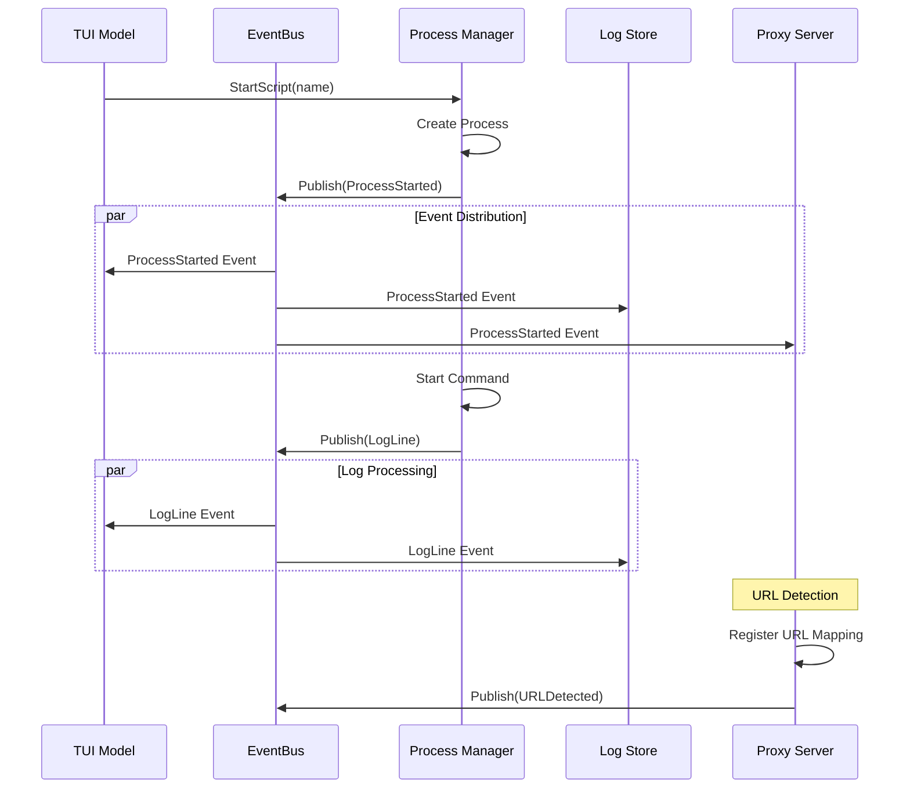

# Component Interaction Flows and Synchronization Points

## Overview

This document defines the data flow patterns, synchronization points, and interaction protocols between all Brummer components. It provides a comprehensive view of how components communicate safely in the synchronized architecture.

## Component Interaction Architecture

### 1. Component Relationship Diagram

```
                    ┌─────────────────┐
                    │   TUI Model     │
                    │  (UI Thread)    │
                    └─────────┬───────┘
                              │ UI Events
                              │ State Updates
                    ┌─────────▼───────┐
                    │   EventBus      │◄─────────────┐
                    │ (Worker Pool)   │              │
                    └─────────┬───────┘              │
                              │ Events               │ Events
                    ┌─────────▼───────┐              │
                    │ Process Manager │              │
                    │  (Process Mgmt) │              │
                    └─────────┬───────┘              │
                              │ Log Lines            │
                    ┌─────────▼───────┐              │
                    │   Log Store     │              │
                    │ (Single Worker) │              │
                    └─────────┬───────┘              │
                              │ Log Events           │
                    ┌─────────▼───────┐              │
                    │  Proxy Server   │──────────────┘
                    │  (HTTP Proxy)   │ HTTP Events
                    └─────────┬───────┘
                              │ MCP Calls
                    ┌─────────▼───────┐
                    │  MCP Manager    │
                    │ (Channel-based) │
                    └─────────────────┘
```

## EventBus-Centric Communication Pattern

### 1. Event Flow Architecture

The EventBus serves as the central nervous system with prioritized event flows:

```go
// Event flow priority levels
type EventPriority int
const (
    PriorityHigh   EventPriority = iota // Critical system events
    PriorityMedium                      // Important user events  
    PriorityLow                         // Background events
)

// Event routing matrix
var EventRouting = map[EventType]EventRoutingConfig{
    ProcessStarted: {
        Priority:    PriorityHigh,
        Subscribers: []Component{TUIModel, LogStore, ProxyServer},
        Ordering:    OrderingRequired,
        Timeout:     100 * time.Millisecond,
    },
    LogLine: {
        Priority:    PriorityLow,
        Subscribers: []Component{TUIModel, LogStore},
        Ordering:    OrderingRequired,
        Timeout:     50 * time.Millisecond,
    },
    ErrorDetected: {
        Priority:    PriorityHigh,
        Subscribers: []Component{TUIModel, LogStore, MCPManager},
        Ordering:    NoOrderingRequired,
        Timeout:     200 * time.Millisecond,
    },
}
```

### 2. Event Subscription Patterns

**Component Subscription Strategy**:

```go
// TUI Model - Immediate UI updates
func (m *Model) subscribeToEvents() {
    m.eventBus.Subscribe(ProcessStarted, m.onProcessStarted)
    m.eventBus.Subscribe(ProcessExited, m.onProcessExited)
    m.eventBus.Subscribe(LogLine, m.onLogLine)
    m.eventBus.Subscribe(ErrorDetected, m.onErrorDetected)
}

// Log Store - Data persistence
func (ls *LogStore) subscribeToEvents() {
    ls.eventBus.Subscribe(LogLine, ls.addLogEntry)
    ls.eventBus.Subscribe(ErrorDetected, ls.addErrorEntry)
    ls.eventBus.Subscribe(ProcessExited, ls.cleanupProcessLogs)
}

// Proxy Server - Request tracking
func (ps *ProxyServer) subscribeToEvents() {
    ps.eventBus.Subscribe(ProcessStarted, ps.registerProcessURL)
    ps.eventBus.Subscribe(ProcessExited, ps.unregisterProcessURL)
}
```

## Data Flow Patterns

### 1. Process Lifecycle Flow

**Process Start Sequence**:


**Synchronization Points**:
1. **Process Creation**: Process Manager holds lock during process map update
2. **Event Publishing**: EventBus handles concurrent publishing safely
3. **UI Updates**: TUI Model locks state during updates
4. **Log Storage**: Log Store serializes all operations through single worker

### 2. Log Processing Flow

**Log Line Processing Pipeline**:
```go
// Process Manager log capture
func (pm *ProcessManager) streamLogs(processID string, reader io.Reader) {
    scanner := bufio.NewScanner(reader)
    for scanner.Scan() {
        line := scanner.Text()
        
        // Immediate callback (synchronous)
        pm.mu.RLock()
        callbacks := pm.logCallbacks
        pm.mu.RUnlock()
        
        for _, callback := range callbacks {
            callback(processID, line, false)
        }
        
        // Asynchronous event publishing
        pm.eventBus.PublishAsync(events.Event{
            Type:      events.LogLine,
            ProcessID: processID,
            Data: map[string]interface{}{
                "line":    line,
                "isError": false,
            },
        })
    }
}

// Log Store processing
func (ls *LogStore) processLogRequests() {
    for {
        select {
        case req := <-ls.addCh:
            // Single-threaded processing ensures ordering
            entry := ls.createLogEntry(req)
            ls.entries = append(ls.entries, entry)
            ls.updateIndices(entry)
            
            // URL detection
            if urls := ls.detectURLs(entry.Content); len(urls) > 0 {
                ls.updateURLMappings(urls, entry.ProcessID)
            }
            
            req.responseCh <- entry
            
        case <-ls.stopCh:
            return
        }
    }
}
```

### 3. Proxy Request Flow

**HTTP Request Processing Pipeline**:
```go
// Proxy Server request handling
func (ps *ProxyServer) handleRequest(w http.ResponseWriter, r *http.Request) {
    startTime := time.Now()
    
    // Atomic metrics update
    atomic.AddInt64(&ps.totalRequests, 1)
    
    // Process request
    response := ps.processRequest(r)
    
    // Update metrics atomically
    duration := time.Since(startTime)
    atomic.AddInt64(&ps.totalDuration, int64(duration))
    
    if response.StatusCode >= 400 {
        atomic.AddInt64(&ps.failedRequests, 1)
    } else {
        atomic.AddInt64(&ps.successRequests, 1)
    }
    
    // Store request data (protected by mutex)
    ps.mu.Lock()
    ps.requests = append(ps.requests, Request{
        ID:         generateID(),
        Method:     r.Method,
        URL:        r.URL.String(),
        StatusCode: response.StatusCode,
        Duration:   duration,
        StartTime:  startTime,
    })
    
    // Bounded storage
    if len(ps.requests) > 1000 {
        ps.requests = ps.requests[1:]
    }
    ps.mu.Unlock()
    
    // Asynchronous event publishing
    ps.eventBus.PublishAsync(events.Event{
        Type: events.EventType("proxy.request"),
        Data: map[string]interface{}{
            "method":   r.Method,
            "url":      r.URL.String(),
            "status":   response.StatusCode,
            "duration": duration.Milliseconds(),
        },
    })
}
```

## Synchronization Point Analysis

### 1. Critical Synchronization Points

**EventBus Synchronization**:
```go
// Handler registration (rare, during startup)
func (eb *EventBus) Subscribe(eventType EventType, handler Handler) {
    eb.updateMu.Lock()
    defer eb.updateMu.Unlock()
    
    // Copy-on-write pattern
    oldMap := eb.handlers.Load().(map[EventType][]Handler)
    newMap := make(map[EventType][]Handler)
    for k, v := range oldMap {
        newMap[k] = v
    }
    newMap[eventType] = append(newMap[eventType], handler)
    
    // Atomic swap
    eb.handlers.Store(newMap)
}

// Event publishing (frequent, performance-critical)
func (eb *EventBus) Publish(event Event) error {
    // Lock-free read
    handlersMap := eb.handlers.Load().(map[EventType][]Handler)
    handlers := handlersMap[event.Type]
    
    if len(handlers) == 0 {
        return nil
    }
    
    // Submit to worker pool
    job := eventJob{
        event:    event,
        handlers: handlers,
        priority: getEventPriority(event.Type),
    }
    
    select {
    case eb.eventQueues[job.priority] <- job:
        return nil
    case <-time.After(100 * time.Millisecond):
        return ErrEventQueueFull
    }
}
```

**Process Manager Synchronization**:
```go
// Process map access patterns
func (pm *ProcessManager) GetProcess(processID string) (*Process, bool) {
    pm.processMu.RLock()
    defer pm.processMu.RUnlock()
    
    process, exists := pm.processes[processID]
    return process, exists
}

func (pm *ProcessManager) addProcess(process *Process) {
    pm.processMu.Lock()
    defer pm.processMu.Unlock()
    
    pm.processes[process.ID] = process
}

// Process status (lock-free atomic operations)
func (p *Process) SetStatus(status ProcessStatus) {
    atomic.StoreInt32(&p.status, int32(status))
}

func (p *Process) GetStatus() ProcessStatus {
    return ProcessStatus(atomic.LoadInt32(&p.status))
}
```

**TUI Model Synchronization**:
```go
// State updates (write operations)
func (m *Model) Update(msg tea.Msg) (tea.Model, tea.Cmd) {
    m.mu.Lock()
    defer m.mu.Unlock()
    
    switch msg := msg.(type) {
    case ProcessStartedMsg:
        m.processes = append(m.processes, msg.Process)
        m.refreshProcessView()
    case LogLineMsg:
        m.logs = append(m.logs, msg.Entry)
        m.refreshLogView()
    }
    
    return m, nil
}

// State reads (rendering)
func (m *Model) View() string {
    m.mu.RLock()
    defer m.mu.RUnlock()
    
    return m.renderCurrentView()
}
```

### 2. Lock Hierarchy and Deadlock Prevention

**Established Lock Ordering**:
1. **Level 1**: EventBus.updateMu (handler registration)
2. **Level 2**: ProcessManager.processMu (process map)
3. **Level 3**: ProcessManager.callbackMu (callbacks)
4. **Level 4**: ProxyServer.mu (request data)
5. **Level 5**: TUIModel.mu (UI state)

**Deadlock Prevention Rules**:
- Never acquire locks in reverse order
- Hold locks for minimal time
- Use atomic operations where possible
- Never call external functions while holding locks
- Use defer for lock releases

```go
// Correct lock ordering example
func (pm *ProcessManager) notifyProcessUpdate(processID string) {
    // Get process info first
    pm.processMu.RLock()
    process, exists := pm.processes[processID]
    pm.processMu.RUnlock()
    
    if !exists {
        return
    }
    
    // Then get callbacks
    pm.callbackMu.RLock()
    callbacks := make([]LogCallback, len(pm.logCallbacks))
    copy(callbacks, pm.logCallbacks)
    pm.callbackMu.RUnlock()
    
    // Call callbacks without holding any locks
    for _, callback := range callbacks {
        callback(processID, "Process updated", false)
    }
}
```

## Data Consistency Patterns

### 1. Eventual Consistency Model

**Cross-Component Data Synchronization**:
```go
// Process state consistency across components
func (pm *ProcessManager) processStateChanged(processID string, newState ProcessStatus) {
    // Update internal state first
    pm.processMu.RLock()
    process, exists := pm.processes[processID]
    pm.processMu.RUnlock()
    
    if !exists {
        return
    }
    
    // Atomic status update
    process.SetStatus(newState)
    
    // Notify other components via event
    pm.eventBus.PublishAsync(events.Event{
        Type:      events.ProcessStateChanged,
        ProcessID: processID,
        Data: map[string]interface{}{
            "oldState": process.previousStatus,
            "newState": newState,
            "timestamp": time.Now(),
        },
    })
}

// TUI Model receives and applies updates
func (m *Model) onProcessStateChanged(event events.Event) {
    processID := event.ProcessID
    newState := event.Data["newState"].(ProcessStatus)
    
    m.mu.Lock()
    defer m.mu.Unlock()
    
    // Find and update process in UI state
    for i, p := range m.processes {
        if p.ID == processID {
            m.processes[i].Status = newState
            break
        }
    }
    
    // Trigger UI refresh
    m.needsRefresh = true
}
```

### 2. Transactional Operations

**Log Store Batch Operations**:
```go
// Atomic batch log insertion
func (ls *LogStore) AddBatch(entries []LogEntryInput) ([]LogEntry, error) {
    req := batchAddRequest{
        entries:    entries,
        responseCh: make(chan batchAddResponse),
    }
    
    select {
    case ls.batchAddCh <- req:
        resp := <-req.responseCh
        return resp.entries, resp.error
    case <-time.After(ls.config.BatchTimeout):
        return nil, ErrBatchTimeout
    }
}

func (ls *LogStore) processBatchAdd(req batchAddRequest) {
    var results []LogEntry
    
    // Process all entries in single transaction
    for _, input := range req.entries {
        entry := LogEntry{
            ID:          ls.generateID(),
            ProcessID:   input.ProcessID,
            ProcessName: input.ProcessName,
            Content:     input.Content,
            Timestamp:   time.Now(),
            IsError:     input.IsError,
        }
        
        // Add to store
        ls.entries = append(ls.entries, entry)
        ls.updateIndices(entry)
        
        results = append(results, entry)
    }
    
    // Atomic response
    req.responseCh <- batchAddResponse{
        entries: results,
        error:   nil,
    }
}
```

## Error Handling and Recovery Flows

### 1. Component Failure Isolation

**Error Propagation Strategy**:
```go
// EventBus error isolation
func (eb *EventBus) processEvent(job eventJob) {
    defer func() {
        if r := recover(); r != nil {
            // Handler panic doesn't crash worker
            eb.metrics.HandlerPanics.Add(1)
            
            // Publish error event
            eb.publishSystemEvent(events.Event{
                Type: events.HandlerPanic,
                Data: map[string]interface{}{
                    "panic":     r,
                    "stack":     debug.Stack(),
                    "eventType": job.event.Type,
                },
            })
        }
    }()
    
    // Execute handlers
    for _, handler := range job.handlers {
        func() {
            defer func() {
                if r := recover(); r != nil {
                    // Individual handler panic
                    eb.metrics.IndividualHandlerPanics.Add(1)
                }
            }()
            
            handler(job.event)
        }()
    }
}

// Component health monitoring
func (cm *ComponentManager) monitorComponentHealth() {
    ticker := time.NewTicker(5 * time.Second)
    defer ticker.Stop()
    
    for range ticker.C {
        for name, component := range cm.components {
            if !component.IsHealthy() {
                cm.handleUnhealthyComponent(name, component)
            }
        }
    }
}

func (cm *ComponentManager) handleUnhealthyComponent(name string, component Component) {
    switch component.GetHealthStatus() {
    case HealthDegraded:
        // Reduce component load
        component.SetDegradedMode(true)
        
    case HealthFailing:
        // Attempt recovery
        if err := component.Recover(); err != nil {
            cm.logger.Printf("Component %s recovery failed: %v", name, err)
        }
        
    case HealthFailed:
        // Isolate component
        component.Shutdown()
        cm.enableBackupComponent(name)
    }
}
```

### 2. Graceful Degradation Patterns

**Service Degradation Hierarchy**:
```go
// Progressive service degradation
type DegradationLevel int
const (
    FullService DegradationLevel = iota
    ReducedService
    EssentialService
    EmergencyService
)

func (app *Application) handleResourcePressure(level ResourcePressureLevel) {
    switch level {
    case PressureHigh:
        app.setDegradationLevel(ReducedService)
        app.eventBus.SetBackpressureMode(BackpressureDropLowPriority)
        app.logStore.SetBatchSize(200) // Larger batches
        
    case PressureCritical:
        app.setDegradationLevel(EssentialService)
        app.eventBus.SetBackpressureMode(BackpressureDropMediumAndLow)
        app.logStore.SetMaxEntries(5000) // Reduce memory
        app.proxyServer.SetMaxConnections(25) // Reduce connections
        
    case PressureEmergency:
        app.setDegradationLevel(EmergencyService)
        app.eventBus.SetBackpressureMode(BackpressureDropAll)
        app.disableNonEssentialComponents()
    }
}

func (app *Application) disableNonEssentialComponents() {
    // Keep only essential functions
    app.proxyServer.DisableTelemetry()
    app.logStore.DisableURLDetection()
    app.tuiModel.SetMinimalMode(true)
    app.mcpManager.DisableHealthMonitoring()
}
```

## Performance Optimization Flows

### 1. Hot Path Optimization

**Critical Path Identification**:
```go
// Optimized event publishing (hot path)
func (eb *EventBus) PublishFast(event Event) {
    // Skip validation and enrichment for performance
    handlersMap := eb.handlers.Load().(map[EventType][]Handler)
    handlers := handlersMap[event.Type]
    
    if len(handlers) == 0 {
        return
    }
    
    // Direct worker assignment for high-priority events
    if event.Type == ProcessStarted || event.Type == ErrorDetected {
        eb.highPriorityQueue <- eventJob{
            event:    event,
            handlers: handlers,
            priority: PriorityHigh,
        }
        return
    }
    
    // Normal path for other events
    eb.Publish(event)
}

// Optimized log processing (hot path)
func (ls *LogStore) AddFast(processID, content string) {
    // Skip validation and metadata for performance
    entry := LogEntry{
        ID:        ls.fastGenerateID(),
        ProcessID: processID,
        Content:   content,
        Timestamp: time.Now(),
    }
    
    // Direct insertion without channel overhead
    ls.fastInsert(entry)
}
```

### 2. Batch Processing Patterns

**Efficient Bulk Operations**:
```go
// EventBus batch event processing
func (eb *EventBus) processBatchEvents() {
    var batch []eventJob
    batchSize := 0
    maxBatchSize := 10
    timeout := time.NewTimer(10 * time.Millisecond)
    
    for {
        select {
        case job := <-eb.eventQueue:
            batch = append(batch, job)
            batchSize++
            
            if batchSize >= maxBatchSize {
                eb.executeBatch(batch)
                batch = batch[:0]
                batchSize = 0
                timeout.Reset(10 * time.Millisecond)
            }
            
        case <-timeout.C:
            if batchSize > 0 {
                eb.executeBatch(batch)
                batch = batch[:0]
                batchSize = 0
            }
            timeout.Reset(10 * time.Millisecond)
            
        case <-eb.stopCh:
            if batchSize > 0 {
                eb.executeBatch(batch)
            }
            return
        }
    }
}

func (eb *EventBus) executeBatch(batch []eventJob) {
    // Group jobs by event type for efficiency
    eventGroups := make(map[EventType][]eventJob)
    for _, job := range batch {
        eventGroups[job.event.Type] = append(eventGroups[job.event.Type], job)
    }
    
    // Process groups in parallel
    var wg sync.WaitGroup
    for eventType, jobs := range eventGroups {
        wg.Add(1)
        go func(et EventType, js []eventJob) {
            defer wg.Done()
            eb.processEventGroup(et, js)
        }(eventType, jobs)
    }
    wg.Wait()
}
```

## Component Startup and Shutdown Flows

### 1. Coordinated Startup Sequence

**Dependency-Ordered Startup**:
```go
// Application startup coordinator
func (app *Application) Start(ctx context.Context) error {
    startupOrder := []StartupStep{
        {Component: "EventBus", StartFunc: app.eventBus.Start},
        {Component: "LogStore", StartFunc: app.logStore.Start},
        {Component: "ProcessManager", StartFunc: app.processManager.Start},
        {Component: "ProxyServer", StartFunc: app.proxyServer.Start},
        {Component: "MCPManager", StartFunc: app.mcpManager.Start},
        {Component: "TUIModel", StartFunc: app.tuiModel.Start},
    }
    
    for i, step := range startupOrder {
        if err := step.StartFunc(ctx); err != nil {
            // Cleanup already started components
            app.shutdownComponents(startupOrder[:i])
            return fmt.Errorf("failed to start %s: %w", step.Component, err)
        }
    }
    
    return nil
}

func (app *Application) shutdownComponents(steps []StartupStep) {
    // Shutdown in reverse order
    for i := len(steps) - 1; i >= 0; i-- {
        if err := steps[i].Component.Stop(); err != nil {
            app.logger.Printf("Error stopping %s: %v", steps[i].Component, err)
        }
    }
}
```

### 2. Graceful Shutdown Sequence

**Component Shutdown Coordination**:
```go
// Coordinated shutdown with timeouts
func (app *Application) Shutdown(ctx context.Context) error {
    shutdownCtx, cancel := context.WithTimeout(ctx, 30*time.Second)
    defer cancel()
    
    // Phase 1: Stop accepting new work
    app.mcpManager.StopAcceptingConnections()
    app.proxyServer.StopAcceptingRequests()
    app.processManager.StopAcceptingCommands()
    
    // Phase 2: Drain work queues
    if err := app.drainWorkQueues(shutdownCtx); err != nil {
        return fmt.Errorf("failed to drain work queues: %w", err)
    }
    
    // Phase 3: Stop components in reverse dependency order
    shutdownOrder := []string{
        "TUIModel", "MCPManager", "ProxyServer", 
        "ProcessManager", "LogStore", "EventBus",
    }
    
    for _, componentName := range shutdownOrder {
        component := app.getComponent(componentName)
        if err := component.Stop(); err != nil {
            app.logger.Printf("Error stopping %s: %v", componentName, err)
        }
    }
    
    return nil
}

func (app *Application) drainWorkQueues(ctx context.Context) error {
    drainComplete := make(chan struct{})
    
    go func() {
        defer close(drainComplete)
        
        // Wait for all queues to drain
        app.eventBus.WaitForQueueDrain()
        app.logStore.WaitForQueueDrain()
        app.processManager.WaitForOperationsComplete()
    }()
    
    select {
    case <-drainComplete:
        return nil
    case <-ctx.Done():
        return ctx.Err()
    }
}
```

## Conclusion

This component interaction design provides:

1. **Clear Data Flows**: Well-defined paths for all data movement
2. **Synchronized Access**: Safe concurrent access patterns
3. **Error Isolation**: Component failures don't cascade
4. **Performance Optimization**: Hot paths and batch processing
5. **Graceful Degradation**: Service continues under pressure
6. **Coordinated Lifecycle**: Proper startup and shutdown sequences
7. **Deadlock Prevention**: Hierarchical lock ordering
8. **Eventual Consistency**: Cross-component data synchronization

The design ensures that all components work together safely while maintaining high performance and reliability under concurrent load.