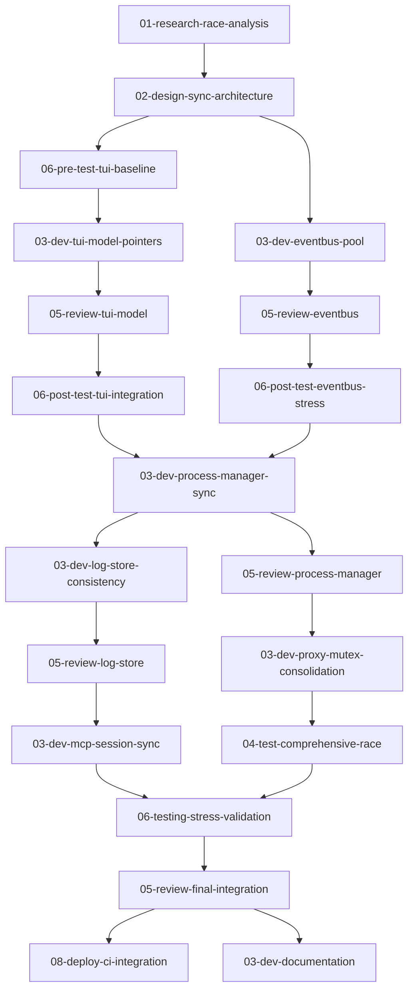

# Product Requirements Document - Race Condition Fixes

## Overview

### Request Summary
Comprehensive elimination of race conditions and deadlock risks identified in the Brummer codebase through systematic analysis and remediation.

### Business Context
Race conditions in the Brummer development environment tool can lead to:
- **Data corruption** affecting development workflows
- **System crashes** interrupting development sessions  
- **Silent failures** causing lost work and debugging time
- **Resource exhaustion** degrading system performance
- **Security vulnerabilities** in concurrent operations

### Success Criteria
- Zero race conditions detected by `go test -race`
- Zero deadlocks under stress testing
- Improved system stability and reliability
- Maintained or improved performance characteristics
- Comprehensive test coverage for concurrent scenarios

## Goals & Objectives

### Primary Goals
1. **Eliminate Critical Race Conditions**
   - Fix TUI Model value receiver issues (60+ methods)
   - Implement EventBus worker pool to prevent goroutine exhaustion
   - Secure Process Manager concurrent map operations
   - Resolve Log Store async/sync operation conflicts

2. **Prevent Deadlock Scenarios**
   - Implement consistent lock ordering
   - Eliminate multiple mutex anti-patterns
   - Add timeout mechanisms for blocking operations

3. **Enhance System Reliability**
   - Implement proper goroutine lifecycle management
   - Add comprehensive error handling for concurrent operations
   - Establish resource limits and monitoring

### Secondary Objectives
1. **Performance Optimization**
   - Minimize synchronization overhead
   - Implement lock-free patterns where appropriate
   - Optimize channel operations and buffer sizing

2. **Testing Infrastructure**
   - Create comprehensive race condition test suite
   - Implement continuous race detection in CI/CD
   - Add stress testing for high-concurrency scenarios

3. **Documentation and Prevention**
   - Document concurrency patterns and best practices
   - Create code review guidelines for race condition prevention
   - Establish monitoring and alerting for production issues

### Non-Goals (Out of Scope)
- Complete architectural redesign (work within existing patterns)
- External dependency updates (unless security-critical)
- Performance optimizations not related to race conditions
- New feature development (focus on stability)

## High-Level Plan

### Architecture Overview
The fix implementation follows a layered approach:

1. **Foundation Layer**: Fix core synchronization primitives (EventBus, TUI Model)
2. **Service Layer**: Secure individual services (Process Manager, Log Store, Proxy)
3. **Integration Layer**: Ensure proper cross-component synchronization
4. **Testing Layer**: Comprehensive validation and stress testing

### Component Breakdown

#### Phase 1: Critical Foundation Fixes (Days 1-2)
- **TUI Model Pointer Receivers**: Convert all value receivers to pointer receivers
- **EventBus Worker Pool**: Implement semaphore-based goroutine limiting
- **Process Manager Synchronization**: Ensure consistent mutex usage

#### Phase 2: Service-Level Fixes (Days 3-4)  
- **Log Store Consistency**: Eliminate async/sync operation conflicts
- **Proxy Server Mutex Consolidation**: Single mutex hierarchy
- **MCP Connection Manager**: Channel-based session management

#### Phase 3: Integration and Testing (Days 5-6)
- **Cross-Component Validation**: Ensure proper event flow
- **Stress Testing**: High-concurrency scenario validation
- **Performance Benchmarking**: Verify no regression

#### Phase 4: Documentation and Prevention (Day 7)
- **Code Review Guidelines**: Race condition prevention checklist
- **CI/CD Integration**: Automated race detection
- **Monitoring Setup**: Runtime race condition detection

### Integration Points
- TUI Model synchronization affects all UI operations
- EventBus changes impact all component communication
- Process Manager fixes affect log generation and proxy operations
- Testing infrastructure validates all component interactions

## Constraints

### Technical Constraints
- **Backward Compatibility**: Maintain existing API contracts
- **Performance Requirements**: No more than 10% performance degradation
- **Memory Constraints**: Goroutine pools must be bounded
- **Go Version**: Must work with current Go toolchain

### Time Constraints
- **Critical Fixes**: Must be completed within 48 hours
- **Full Implementation**: Complete within 7 days
- **Testing Validation**: Continuous throughout implementation
- **Production Deployment**: Staged rollout over 2 weeks

### Resource Constraints
- **Development Team**: Senior Go developer with concurrency expertise
- **Testing Resources**: Automated testing infrastructure
- **Review Resources**: Code review by concurrent programming expert
- **Monitoring Tools**: Race detection and performance monitoring

### Dependencies
- **External Dependencies**: No new dependencies unless critical
- **Build System**: Must integrate with existing Makefile and CI
- **Testing Framework**: Use existing Go testing infrastructure
- **Documentation**: Integrate with existing documentation system

## Risk Assessment

### Technical Complexity: HIGH
- **TUI Model Changes**: 60+ methods require careful conversion
- **EventBus Redesign**: Worker pool implementation affects all components
- **Synchronization Patterns**: Complex interaction between multiple mutexes
- **Testing Coverage**: Ensuring comprehensive race condition detection

### Integration Points: HIGH
- **Cross-Component Communication**: EventBus changes affect all subscribers
- **State Management**: TUI Model changes affect all UI operations
- **Process Lifecycle**: Manager changes affect logging and proxy operations
- **Network Operations**: Proxy and MCP changes affect external interfaces

### Security Vulnerabilities: MEDIUM
- **Race Conditions**: Can lead to security bypasses in authentication/authorization
- **Resource Exhaustion**: Unlimited goroutines can cause denial of service
- **Data Corruption**: Race conditions can corrupt configuration or log data
- **Timing Attacks**: Inconsistent synchronization can leak timing information

### Performance Bottlenecks: MEDIUM
- **Synchronization Overhead**: Additional mutexes may impact performance
- **Worker Pool Sizing**: Incorrect sizing can cause bottlenecks or waste
- **Channel Operations**: Improper buffering can cause blocking
- **Memory Usage**: Bounded pools may increase memory pressure

### Breaking Changes: LOW
- **API Compatibility**: Most changes are internal implementation
- **Configuration**: May require new configuration options
- **Build Process**: May require updated build/test commands
- **Deployment**: Staged rollout minimizes risk

### Mitigation Strategies

#### High-Risk Mitigation
1. **Comprehensive Testing**: Implement thorough test suite before deployment
2. **Staged Rollout**: Deploy fixes incrementally with rollback capability
3. **Performance Monitoring**: Continuous monitoring during deployment
4. **Expert Review**: Code review by concurrency programming expert

#### Medium-Risk Mitigation
1. **Security Testing**: Specific security validation for concurrent operations
2. **Performance Benchmarking**: Before/after performance comparison
3. **Load Testing**: Validate under realistic production loads
4. **Documentation**: Clear documentation of all changes and patterns

#### Low-Risk Mitigation
1. **Backward Compatibility Testing**: Ensure existing functionality works
2. **Configuration Migration**: Smooth transition for configuration changes
3. **User Communication**: Clear documentation of any behavioral changes
4. **Support Preparation**: Support team training on new patterns

## Task Breakdown

### Task List (Ordered by Risk - High Risk First)

#### Critical Priority (P0) - Days 1-2

**01-research-race-analysis**
- **Risk Level**: LOW (Research only)
- **Dependencies**: None
- **Effort**: 2 hours
- **Persona**: Research Analyst
- **Description**: Comprehensive analysis of current race conditions and best practices

**02-design-sync-architecture**  
- **Risk Level**: MEDIUM (Architecture changes)
- **Dependencies**: 01-research-race-analysis
- **Effort**: 4 hours
- **Persona**: System Architect
- **Description**: Design synchronized architecture patterns and worker pool sizing

**06-pre-test-tui-baseline**
- **Risk Level**: LOW (Testing)
- **Dependencies**: None
- **Effort**: 1 hour
- **Persona**: Test Engineer
- **Description**: Establish TUI system baseline before critical changes

**03-dev-tui-model-pointers** ⚠️ **CRITICAL**
- **Risk Level**: HIGH (60+ method changes)
- **Dependencies**: 02-design-sync-architecture, 06-pre-test-tui-baseline
- **Effort**: 8 hours
- **Persona**: Software Engineer
- **Description**: Convert TUI Model from value to pointer receivers

**05-review-tui-model**
- **Risk Level**: HIGH (Critical system review)
- **Dependencies**: 03-dev-tui-model-pointers
- **Effort**: 3 hours
- **Persona**: Senior Engineer
- **Description**: Comprehensive review of TUI Model changes

**06-post-test-tui-integration**
- **Risk Level**: HIGH (Integration testing)
- **Dependencies**: 05-review-tui-model
- **Effort**: 2 hours
- **Persona**: Test Engineer
- **Description**: Validate TUI system after pointer receiver changes

**03-dev-eventbus-pool** ⚠️ **CRITICAL**
- **Risk Level**: HIGH (Core system change)
- **Dependencies**: 02-design-sync-architecture
- **Effort**: 6 hours
- **Persona**: Software Engineer
- **Description**: Implement EventBus worker pool to prevent goroutine exhaustion

**05-review-eventbus**
- **Risk Level**: HIGH (Core system review)
- **Dependencies**: 03-dev-eventbus-pool
- **Effort**: 2 hours
- **Persona**: Senior Engineer
- **Description**: Review EventBus worker pool implementation

**06-post-test-eventbus-stress**
- **Risk Level**: HIGH (Stress testing)
- **Dependencies**: 05-review-eventbus
- **Effort**: 3 hours
- **Persona**: Test Engineer
- **Description**: Stress test EventBus worker pool under high load

#### High Priority (P1) - Days 3-4

**03-dev-process-manager-sync** ⚠️ **HIGH**
- **Risk Level**: HIGH (Concurrent map operations)
- **Dependencies**: 06-post-test-eventbus-stress
- **Effort**: 6 hours
- **Persona**: Software Engineer
- **Description**: Fix Process Manager concurrent map access patterns

**05-review-process-manager**
- **Risk Level**: MEDIUM (Service review)
- **Dependencies**: 03-dev-process-manager-sync
- **Effort**: 2 hours
- **Persona**: Senior Engineer
- **Description**: Review Process Manager synchronization

**03-dev-log-store-consistency** ⚠️ **HIGH**
- **Risk Level**: HIGH (Data consistency)
- **Dependencies**: 03-dev-process-manager-sync
- **Effort**: 6 hours
- **Persona**: Software Engineer
- **Description**: Eliminate Log Store async/sync operation conflicts

**05-review-log-store**
- **Risk Level**: MEDIUM (Data integrity review)
- **Dependencies**: 03-dev-log-store-consistency
- **Effort**: 2 hours
- **Persona**: Senior Engineer
- **Description**: Review Log Store consistency improvements

**03-dev-proxy-mutex-consolidation** ⚠️ **HIGH**
- **Risk Level**: MEDIUM (Deadlock prevention)
- **Dependencies**: 05-review-process-manager
- **Effort**: 4 hours
- **Persona**: Software Engineer
- **Description**: Consolidate Proxy Server multiple mutex anti-pattern

#### Medium Priority (P2) - Days 5-6

**03-dev-mcp-session-sync**
- **Risk Level**: MEDIUM (Session management)
- **Dependencies**: 05-review-log-store
- **Effort**: 4 hours
- **Persona**: Software Engineer
- **Description**: Implement channel-based MCP session management

**04-test-comprehensive-race**
- **Risk Level**: MEDIUM (Test development)
- **Dependencies**: 03-dev-proxy-mutex-consolidation
- **Effort**: 6 hours
- **Persona**: QA Engineer
- **Description**: Create comprehensive race condition test suite

**06-testing-stress-validation**
- **Risk Level**: MEDIUM (System validation)
- **Dependencies**: 03-dev-mcp-session-sync, 04-test-comprehensive-race
- **Effort**: 4 hours
- **Persona**: Test Engineer
- **Description**: Execute full system stress testing

**05-review-final-integration**
- **Risk Level**: LOW (Final review)
- **Dependencies**: 06-testing-stress-validation
- **Effort**: 4 hours
- **Persona**: Senior Engineer
- **Description**: Comprehensive final code review

#### Documentation Priority (P3) - Day 7

**08-deploy-ci-integration**
- **Risk Level**: LOW (Process improvement)
- **Dependencies**: 05-review-final-integration
- **Effort**: 3 hours
- **Persona**: Release Engineer
- **Description**: Integrate race detection into CI/CD pipeline

**03-dev-documentation**
- **Risk Level**: LOW (Documentation)
- **Dependencies**: 05-review-final-integration
- **Effort**: 4 hours
- **Persona**: Software Engineer
- **Description**: Update documentation with concurrency patterns

### Dependencies Between Tasks

### Estimated Effort Per Task
- **Total Development Time**: 60 hours (7.5 days)
- **Critical Path Duration**: 5 days (with parallel execution)
- **Testing Time**: 20 hours (included in total)
- **Review Time**: 15 hours (included in total)
- **Documentation Time**: 7 hours (included in total)

### Risk Mitigation for High-Risk Items

#### TUI Model Pointer Conversion (HIGH RISK)
- **Spike Task**: Create proof-of-concept with 5 methods first
- **Validation**: Continuous testing during conversion
- **Rollback**: Git worktree allows instant rollback
- **Progressive**: Convert methods in logical groups

#### EventBus Worker Pool (HIGH RISK)
- **Spike Task**: Prototype worker pool with configurable sizing
- **Validation**: Stress testing with goroutine monitoring
- **Fallback**: Synchronous execution when pool full
- **Monitoring**: Runtime goroutine count tracking

#### Process Manager Synchronization (HIGH RISK)
- **Spike Task**: Test concurrent map access patterns
- **Validation**: Race detector during all operations
- **Isolation**: Change one operation at a time
- **Verification**: Comprehensive unit and integration tests